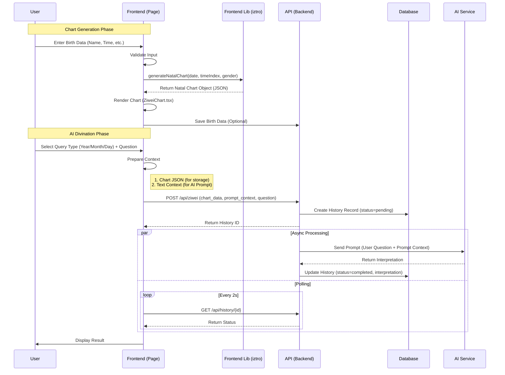

# Zi Wei Dou Shu (紫微斗數) Module Architecture

## Overview
The Zi Wei Dou Shu module has been migrated to a **Hybrid Architecture** where chart calculation is performed on the **Frontend** using `iztro`, while data persistence and AI interpretation remain on the **Backend**.

### Key Benefits
1.  **Latency**: Instant chart generation (no compiled Python latency).
2.  **Interactivity**: Real-time updates for time-based charts (Yearly/Monthly flow).
3.  **Consistency**: Single source of truth for display and AI context (the `iztro` object).

---

## System Flow

### Sequence Diagram


---

## Data Structures

### 1. Frontend Model (Iztro / CamelCase)
The frontend uses the `iztro` library structure. Key interfaces in `ZiweiChart.tsx`:

```typescript
interface Palace {
  index: number;          // 0-11
  name: string;           // e.g. "命宮"
  heavenlyStem: string;   // e.g. "甲"
  earthlyBranch: string;  // e.g. "子"
  majorStars: Star[];     // Scientific 14 stars
  minorStars: Star[];     // Auxiliary stars
  isBodyPalace: boolean;
  isSoulPalace: boolean;
  // ...
}
```

### 2. API Contract (POST /api/ziwei)
The backend accepts the pre-calculated data to avoid re-calculation discrepancies.

```json
{
  "birth_data_id": 123,
  "name": "Test User",
  "gender": "male",
  "birth_date": "1990-01-01T12:00:00",
  "birth_location": "Taipei",
  "query_type": "yearly",
  "query_date": "2025-01-01T00:00:00",
  "question": "My wealth luck?",
  
  "chart_data": { ... },       // Full JSON object from iztro (for DB storage)
  "prompt_context": "...text..." // Pre-formatted string (for AI System Prompt)
}
```

### 3. Database Schema (History Table)
The `chart_data` column in the `history` table stores the raw JSON received from the frontend.

---

## Component Responsibilities

| Component | Layer | Responsibility |
|-----------|-------|----------------|
| `lib/astro.ts` | Frontend | Wrapper around `iztro` package. Handles time index conversion and chart generation calls. |
| `ZiweiChart.tsx` | Frontend | Pure UI component. Visualizes the 12-grid chart from the data object. |
| `ziwei/page.tsx` | Frontend | Main controller. Manages form state, calls `astro.ts`, orchestrates API calls, handles polling. |
| `api/ziwei.py` | Backend | Orchestrator. Receives request, validations, triggers background AI task. |
| `services/ai.py` | Backend | LLM Interface. Sends the `prompt_context` to the configured AI provider. |

## Future Improvements
- **Type Sharing**: Generate TypeScript types from Python Pydantic models (or vice versa) to ensure strict contract alignment.
- **Context Optimization**: Refine the `prompt_context` string generation on the frontend to be more token-efficient for complex charts.
