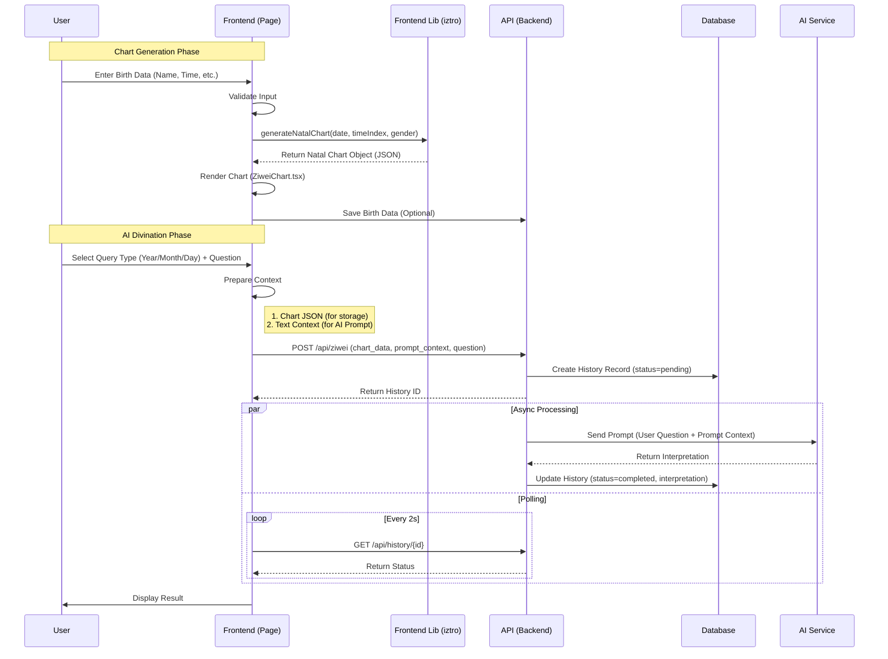

# Zi Wei Dou Shu (紫微斗數) Module Architecture

## Overview
The Zi Wei Dou Shu module has been migrated to a **Hybrid Architecture** where chart calculation is performed on the **Frontend** using `iztro`, while data persistence and AI interpretation remain on the **Backend**.

### Key Benefits
1.  **Latency**: Instant chart generation (no compiled Python latency).
2.  **Interactivity**: Real-time updates for time-based charts (Yearly/Monthly flow).
3.  **Consistency**: Single source of truth for display and AI context (the `iztro` object).

---

## System Flow

### Sequence Diagram


---

## Data Structures

### 1. Frontend Model (Iztro / CamelCase)
The frontend uses the `iztro` library structure. Key interfaces in `ZiweiChart.tsx`:

```typescript
interface Palace {
  index: number;          // 0-11
  name: string;           // e.g. "命宮"
  heavenlyStem: string;   // e.g. "甲"
  earthlyBranch: string;  // e.g. "子"
  majorStars: Star[];     // Scientific 14 stars
  minorStars: Star[];     // Auxiliary stars
  isBodyPalace: boolean;
  isSoulPalace: boolean;
  // ...
}
```

### 2. API Contract (POST /api/ziwei)
The backend accepts the pre-calculated data to avoid re-calculation discrepancies.

```json
{
  "birth_data_id": 123,
  "name": "Test User",
  "gender": "male",
  "birth_date": "1990-01-01T12:00:00",
  "birth_location": "Taipei",
  "query_type": "yearly",
  "query_date": "2025-01-01T00:00:00",
  "question": "My wealth luck?",
  
  "chart_data": { ... },       // Full JSON object from iztro (for DB storage)
  "prompt_context": "...text..." // Pre-formatted string (for AI System Prompt)
}
```

### 3. Chart Data JSON Schema
The `chart_data` field contains the full natal chart object generated by `iztro`.

```json
{
  "type": "object",
  "properties": {
    "gender": { "type": "string", "enum": ["男", "女"] },
    "solarDate": { "type": "string", "description": "YYYY-MM-DD" },
    "lunarDate": { "type": "string", "description": "Chinese Lunar Date string" },
    "chineseDate": { "type": "string", "description": "GanZhi string (e.g. 乙亥 壬午 丁丑 丁未)" },
    "time": { "type": "string", "description": "Chinese Hour Char" },
    "timeRange": { "type": "string" },
    "sign": { "type": "string", "description": "Western Zodiac" },
    "zodiac": { "type": "string", "description": "Chinese Zodiac" },
    "fiveElementsClass": { "type": "string", "description": "e.g. 土五局" },
    "palaces": {
      "type": "array",
      "items": {
        "type": "object",
        "properties": {
          "index": { "type": "integer", "minimum": 0, "maximum": 11 },
          "name": { "type": "string" },
          "heavenlyStem": { "type": "string" },
          "earthlyBranch": { "type": "string" },
          "isBodyPalace": { "type": "boolean" },
          "isSoulPalace": { "type": "boolean" },
          "majorStars": { "$ref": "#/definitions/starArray" },
          "minorStars": { "$ref": "#/definitions/starArray" },
          "adjectiveStars": { "$ref": "#/definitions/starArray" },
          "decadal": {
            "type": "object",
            "properties": {
              "range": { "type": "array", "items": { "type": "integer" } },
              "heavenlyStem": { "type": "string" },
              "earthlyBranch": { "type": "string" }
            }
          },
          "ages": { "type": "array", "items": { "type": "integer" } }
        }
      }
    }
  },
  "definitions": {
    "starArray": {
      "type": "array",
      "items": {
        "type": "object",
        "properties": {
          "name": { "type": "string" },
          "brightness": { "type": "string", "description": "廟/旺/得/利/平/不/陷" },
          "mutagen": { "type": "string", "enum": ["祿", "權", "科", "忌", null] },
          "type": { "type": "string" }
        }
      }
    }
  }
}
```

### 4. Database Schema (History Table)
The `chart_data` column in the `history` table stores the raw JSON received from the frontend.

---

## Component Responsibilities

| Component | Layer | Responsibility |
|-----------|-------|----------------|
| `lib/astro.ts` | Frontend | Wrapper around `iztro` package. Handles time index conversion and chart generation calls. |
| `ZiweiChart.tsx` | Frontend | Pure UI component. Visualizes the 12-grid chart from the data object. |
| `ziwei/page.tsx` | Frontend | Main controller. Manages form state, calls `astro.ts`, orchestrates API calls, handles polling. |
| `api/ziwei.py` | Backend | Orchestrator. Receives request, validations, triggers background AI task. |
| `services/ai.py` | Backend | LLM Interface. Sends the `prompt_context` to the configured AI provider. |

## Future Improvements
- **Type Sharing**: Generate TypeScript types from Python Pydantic models (or vice versa) to ensure strict contract alignment.
- **Context Optimization**: Refine the `prompt_context` string generation on the frontend to be more token-efficient for complex charts.

## Verification Data

**Test Case**:
- Date: 1995-06-15
- Time: Wei Hour (13:00-15:00)
- Gender: Female

```json
{
  "plugins": [],
  "gender": "女",
  "solarDate": "1995-06-15",
  "lunarDate": "一九九五年五月十八",
  "chineseDate": "乙亥 壬午 丁丑 丁未",
  "rawDates": {
    "lunarDate": {
      "lunarYear": 1995,
      "lunarMonth": 5,
      "lunarDay": 18,
      "isLeap": false
    },
    "chineseDate": {
      "yearly": [
        "乙",
        "亥"
      ],
      "monthly": [
        "壬",
        "午"
      ],
      "daily": [
        "丁",
        "丑"
      ],
      "hourly": [
        "丁",
        "未"
      ]
    }
  },
  "time": "未時",
  "timeRange": "13:00~15:00",
  "sign": "雙子座",
  "zodiac": "豬",
  "earthlyBranchOfBodyPalace": "丑",
  "earthlyBranchOfSoulPalace": "亥",
  "soul": "巨門",
  "body": "天機",
  "fiveElementsClass": "土五局",
  "palaces": [
    {
      "index": 0,
      "name": "田宅",
      "isBodyPalace": false,
      "isOriginalPalace": false,
      "heavenlyStem": "戊",
      "earthlyBranch": "寅",
      "majorStars": [
        {
          "name": "天同",
          "type": "major",
          "scope": "origin",
          "brightness": "利",
          "mutagen": ""
        },
        {
          "name": "天梁",
          "type": "major",
          "scope": "origin",
          "brightness": "廟",
          "mutagen": "權"
        }
      ],
      "minorStars": [
        {
          "name": "陀羅",
          "type": "tough",
          "scope": "origin",
          "brightness": "陷"
        }
      ],
      "adjectiveStars": [
        {
          "name": "孤辰",
          "type": "adjective",
          "scope": "origin"
        }
      ],
      "changsheng12": "病",
      "boshi12": "官府",
      "jiangqian12": "亡神",
      "suiqian12": "貫索",
      "decadal": {
        "range": [
          35,
          44
        ],
        "heavenlyStem": "戊",
        "earthlyBranch": "寅"
      },
      "ages": [
        12,
        24,
        36,
        48,
        60,
        72,
        84,
        96,
        108,
        120
      ]
    },
    {
      "index": 1,
      "name": "官祿",
      "isBodyPalace": false,
      "isOriginalPalace": false,
      "heavenlyStem": "己",
      "earthlyBranch": "卯",
      "majorStars": [
        {
          "name": "武曲",
          "type": "major",
          "scope": "origin",
          "brightness": "利",
          "mutagen": ""
        },
        {
          "name": "七殺",
          "type": "major",
          "scope": "origin",
          "brightness": "旺",
          "mutagen": ""
        }
      ],
      "minorStars": [
        {
          "name": "文昌",
          "type": "soft",
          "scope": "origin",
          "brightness": "利",
          "mutagen": ""
        },
        {
          "name": "祿存",
          "type": "lucun",
          "scope": "origin",
          "brightness": ""
        }
      ],
      "adjectiveStars": [
        {
          "name": "天貴",
          "type": "adjective",
          "scope": "origin"
        },
        {
          "name": "龍池",
          "type": "adjective",
          "scope": "origin"
        }
      ],
      "changsheng12": "死",
      "boshi12": "博士",
      "jiangqian12": "將星",
      "suiqian12": "官符",
      "decadal": {
        "range": [
          45,
          54
        ],
        "heavenlyStem": "己",
        "earthlyBranch": "卯"
      },
      "ages": [
        11,
        23,
        35,
        47,
        59,
        71,
        83,
        95,
        107,
        119
      ]
    },
    {
      "index": 2,
      "name": "僕役",
      "isBodyPalace": false,
      "isOriginalPalace": false,
      "heavenlyStem": "庚",
      "earthlyBranch": "辰",
      "majorStars": [
        {
          "name": "太陽",
          "type": "major",
          "scope": "origin",
          "brightness": "旺",
          "mutagen": ""
        }
      ],
      "minorStars": [
        {
          "name": "地空",
          "type": "tough",
          "scope": "origin",
          "brightness": ""
        },
        {
          "name": "火星",
          "type": "tough",
          "scope": "origin",
          "brightness": "陷"
        },
        {
          "name": "擎羊",
          "type": "tough",
          "scope": "origin",
          "brightness": "廟"
        }
      ],
      "adjectiveStars": [
        {
          "name": "紅鸞",
          "type": "flower",
          "scope": "origin"
        },
        {
          "name": "天官",
          "type": "adjective",
          "scope": "origin"
        },
        {
          "name": "月德",
          "type": "adjective",
          "scope": "origin"
        },
        {
          "name": "天傷",
          "type": "adjective",
          "scope": "origin"
        }
      ],
      "changsheng12": "墓",
      "boshi12": "力士",
      "jiangqian12": "攀鞍",
      "suiqian12": "小耗",
      "decadal": {
        "range": [
          55,
          64
        ],
        "heavenlyStem": "庚",
        "earthlyBranch": "辰"
      },
      "ages": [
        10,
        22,
        34,
        46,
        58,
        70,
        82,
        94,
        106,
        118
      ]
    },
    {
      "index": 3,
      "name": "遷移",
      "isBodyPalace": false,
      "isOriginalPalace": false,
      "heavenlyStem": "辛",
      "earthlyBranch": "巳",
      "majorStars": [],
      "minorStars": [
        {
          "name": "天馬",
          "type": "tianma",
          "scope": "origin",
          "brightness": ""
        },
        {
          "name": "鈴星",
          "type": "tough",
          "scope": "origin",
          "brightness": "得"
        }
      ],
      "adjectiveStars": [
        {
          "name": "天姚",
          "type": "flower",
          "scope": "origin"
        },
        {
          "name": "天巫",
          "type": "adjective",
          "scope": "origin"
        },
        {
          "name": "天虛",
          "type": "adjective",
          "scope": "origin"
        }
      ],
      "changsheng12": "絕",
      "boshi12": "青龍",
      "jiangqian12": "歲驛",
      "suiqian12": "大耗",
      "decadal": {
        "range": [
          65,
          74
        ],
        "heavenlyStem": "辛",
        "earthlyBranch": "巳"
      },
      "ages": [
        9,
        21,
        33,
        45,
        57,
        69,
        81,
        93,
        105,
        117
      ]
    },
    {
      "index": 4,
      "name": "疾厄",
      "isBodyPalace": false,
      "isOriginalPalace": false,
      "heavenlyStem": "壬",
      "earthlyBranch": "午",
      "majorStars": [
        {
          "name": "天機",
          "type": "major",
          "scope": "origin",
          "brightness": "廟",
          "mutagen": "祿"
        }
      ],
      "minorStars": [
        {
          "name": "右弼",
          "type": "soft",
          "scope": "origin",
          "brightness": "",
          "mutagen": ""
        },
        {
          "name": "地劫",
          "type": "tough",
          "scope": "origin",
          "brightness": ""
        }
      ],
      "adjectiveStars": [
        {
          "name": "天廚",
          "type": "adjective",
          "scope": "origin"
        },
        {
          "name": "截路",
          "type": "adjective",
          "scope": "origin"
        },
        {
          "name": "陰煞",
          "type": "adjective",
          "scope": "origin"
        },
        {
          "name": "天使",
          "type": "adjective",
          "scope": "origin"
        }
      ],
      "changsheng12": "胎",
      "boshi12": "小耗",
      "jiangqian12": "息神",
      "suiqian12": "龍德",
      "decadal": {
        "range": [
          75,
          84
        ],
        "heavenlyStem": "壬",
        "earthlyBranch": "午"
      },
      "ages": [
        8,
        20,
        32,
        44,
        56,
        68,
        80,
        92,
        104,
        116
      ]
    },
    {
      "index": 5,
      "name": "財帛",
      "isBodyPalace": false,
      "isOriginalPalace": false,
      "heavenlyStem": "癸",
      "earthlyBranch": "未",
      "majorStars": [
        {
          "name": "紫微",
          "type": "major",
          "scope": "origin",
          "brightness": "廟",
          "mutagen": "科"
        },
        {
          "name": "破軍",
          "type": "major",
          "scope": "origin",
          "brightness": "旺",
          "mutagen": ""
        }
      ],
      "minorStars": [],
      "adjectiveStars": [
        {
          "name": "恩光",
          "type": "adjective",
          "scope": "origin"
        },
        {
          "name": "華蓋",
          "type": "adjective",
          "scope": "origin"
        },
        {
          "name": "天月",
          "type": "adjective",
          "scope": "origin"
        },
        {
          "name": "空亡",
          "type": "adjective",
          "scope": "origin"
        },
        {
          "name": "天哭",
          "type": "adjective",
          "scope": "origin"
        }
      ],
      "changsheng12": "養",
      "boshi12": "將軍",
      "jiangqian12": "華蓋",
      "suiqian12": "白虎",
      "decadal": {
        "range": [
          85,
          94
        ],
        "heavenlyStem": "癸",
        "earthlyBranch": "未"
      },
      "ages": [
        7,
        19,
        31,
        43,
        55,
        67,
        79,
        91,
        103,
        115
      ]
    },
    {
      "index": 6,
      "name": "子女",
      "isBodyPalace": false,
      "isOriginalPalace": false,
      "heavenlyStem": "甲",
      "earthlyBranch": "申",
      "majorStars": [],
      "minorStars": [
        {
          "name": "左輔",
          "type": "soft",
          "scope": "origin",
          "brightness": "",
          "mutagen": ""
        },
        {
          "name": "天鉞",
          "type": "soft",
          "scope": "origin",
          "brightness": ""
        }
      ],
      "adjectiveStars": [
        {
          "name": "天福",
          "type": "adjective",
          "scope": "origin"
        },
        {
          "name": "天德",
          "type": "adjective",
          "scope": "origin"
        }
      ],
      "changsheng12": "長生",
      "boshi12": "奏書",
      "jiangqian12": "劫煞",
      "suiqian12": "天德",
      "decadal": {
        "range": [
          95,
          104
        ],
        "heavenlyStem": "甲",
        "earthlyBranch": "申"
      },
      "ages": [
        6,
        18,
        30,
        42,
        54,
        66,
        78,
        90,
        102,
        114
      ]
    },
    {
      "index": 7,
      "name": "夫妻",
      "isBodyPalace": false,
      "isOriginalPalace": true,
      "heavenlyStem": "乙",
      "earthlyBranch": "酉",
      "majorStars": [
        {
          "name": "天府",
          "type": "major",
          "scope": "origin",
          "brightness": "旺",
          "mutagen": ""
        }
      ],
      "minorStars": [],
      "adjectiveStars": [
        {
          "name": "封誥",
          "type": "adjective",
          "scope": "origin"
        },
        {
          "name": "旬空",
          "type": "adjective",
          "scope": "origin"
        },
        {
          "name": "破碎",
          "type": "adjective",
          "scope": "origin"
        }
      ],
      "changsheng12": "沐浴",
      "boshi12": "飛廉",
      "jiangqian12": "災煞",
      "suiqian12": "弔客",
      "decadal": {
        "range": [
          105,
          114
        ],
        "heavenlyStem": "乙",
        "earthlyBranch": "酉"
      },
      "ages": [
        5,
        17,
        29,
        41,
        53,
        65,
        77,
        89,
        101,
        113
      ]
    },
    {
      "index": 8,
      "name": "兄弟",
      "isBodyPalace": false,
      "isOriginalPalace": false,
      "heavenlyStem": "丙",
      "earthlyBranch": "戌",
      "majorStars": [
        {
          "name": "太陰",
          "type": "major",
          "scope": "origin",
          "brightness": "旺",
          "mutagen": "忌"
        }
      ],
      "minorStars": [],
      "adjectiveStars": [
        {
          "name": "天喜",
          "type": "flower",
          "scope": "origin"
        },
        {
          "name": "天才",
          "type": "adjective",
          "scope": "origin"
        },
        {
          "name": "寡宿",
          "type": "adjective",
          "scope": "origin"
        }
      ],
      "changsheng12": "冠帶",
      "boshi12": "喜神",
      "jiangqian12": "天煞",
      "suiqian12": "病符",
      "decadal": {
        "range": [
          115,
          124
        ],
        "heavenlyStem": "丙",
        "earthlyBranch": "戌"
      },
      "ages": [
        4,
        16,
        28,
        40,
        52,
        64,
        76,
        88,
        100,
        112
      ]
    },
    {
      "index": 9,
      "name": "命宮",
      "isBodyPalace": false,
      "isOriginalPalace": false,
      "heavenlyStem": "丁",
      "earthlyBranch": "亥",
      "majorStars": [
        {
          "name": "廉貞",
          "type": "major",
          "scope": "origin",
          "brightness": "陷",
          "mutagen": ""
        },
        {
          "name": "貪狼",
          "type": "major",
          "scope": "origin",
          "brightness": "陷",
          "mutagen": ""
        }
      ],
      "minorStars": [
        {
          "name": "文曲",
          "type": "soft",
          "scope": "origin",
          "brightness": "旺",
          "mutagen": ""
        }
      ],
      "adjectiveStars": [
        {
          "name": "鳳閣",
          "type": "adjective",
          "scope": "origin"
        },
        {
          "name": "年解",
          "type": "helper",
          "scope": "origin"
        }
      ],
      "changsheng12": "臨官",
      "boshi12": "病符",
      "jiangqian12": "指背",
      "suiqian12": "歲建",
      "decadal": {
        "range": [
          5,
          14
        ],
        "heavenlyStem": "丁",
        "earthlyBranch": "亥"
      },
      "ages": [
        3,
        15,
        27,
        39,
        51,
        63,
        75,
        87,
        99,
        111
      ]
    },
    {
      "index": 10,
      "name": "父母",
      "isBodyPalace": false,
      "isOriginalPalace": false,
      "heavenlyStem": "戊",
      "earthlyBranch": "子",
      "majorStars": [
        {
          "name": "巨門",
          "type": "major",
          "scope": "origin",
          "brightness": "旺",
          "mutagen": ""
        }
      ],
      "minorStars": [
        {
          "name": "天魁",
          "type": "soft",
          "scope": "origin",
          "brightness": ""
        }
      ],
      "adjectiveStars": [
        {
          "name": "咸池",
          "type": "flower",
          "scope": "origin"
        },
        {
          "name": "解神",
          "type": "helper",
          "scope": "origin"
        },
        {
          "name": "天壽",
          "type": "adjective",
          "scope": "origin"
        },
        {
          "name": "天空",
          "type": "adjective",
          "scope": "origin"
        }
      ],
      "changsheng12": "帝旺",
      "boshi12": "大耗",
      "jiangqian12": "咸池",
      "suiqian12": "晦氣",
      "decadal": {
        "range": [
          15,
          24
        ],
        "heavenlyStem": "戊",
        "earthlyBranch": "子"
      },
      "ages": [
        2,
        14,
        26,
        38,
        50,
        62,
        74,
        86,
        98,
        110
      ]
    },
    {
      "index": 11,
      "name": "福德",
      "isBodyPalace": true,
      "isOriginalPalace": false,
      "heavenlyStem": "己",
      "earthlyBranch": "丑",
      "majorStars": [
        {
          "name": "天相",
          "type": "major",
          "scope": "origin",
          "brightness": "廟",
          "mutagen": ""
        }
      ],
      "minorStars": [],
      "adjectiveStars": [
        {
          "name": "三台",
          "type": "adjective",
          "scope": "origin"
        },
        {
          "name": "八座",
          "type": "adjective",
          "scope": "origin"
        },
        {
          "name": "台輔",
          "type": "adjective",
          "scope": "origin"
        },
        {
          "name": "蜚廉",
          "type": "adjective",
          "scope": "origin"
        },
        {
          "name": "天刑",
          "type": "adjective",
          "scope": "origin"
        }
      ],
      "changsheng12": "衰",
      "boshi12": "伏兵",
      "jiangqian12": "月煞",
      "suiqian12": "喪門",
      "decadal": {
        "range": [
          25,
          34
        ],
        "heavenlyStem": "己",
        "earthlyBranch": "丑"
      },
      "ages": [
        1,
        13,
        25,
        37,
        49,
        61,
        73,
        85,
        97,
        109
      ]
    }
  ],
  "copyright": "copyright © 2023-2026 iztro (https://github.com/SylarLong/iztro)"
}

```
