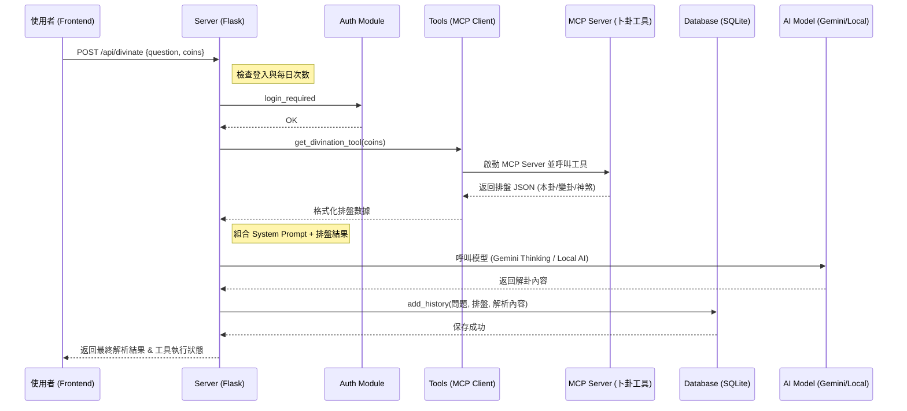

# AI Divination Project Overview

這是一個結合傳統六爻占卜與現代 AI 技術的 Web 應用程式。本文件紀錄了目前版本的架構與技術細節。

## 1. 程式碼結構 (Directory Structure)

```text
AI-Divination/
├── auth.py              # 使用者認證與權限管理 (bcrypt 加密)
├── database.py          # SQLite 資料庫初始化與操作邏輯
├── server.py            # Flask Web 伺服器核心路由
├── tools.py             # MCP 工具接口 (與卜卦 MCP Server 通訊)
├── divination.db        # SQLite 資料庫文件 (Git Ignore)
├── prompts/
│   └── system_prompt.md # AI 角色扮演與輸出格式定義
├── static/
│   ├── style.css        # 全域樣式 (玻璃擬態、玄學風格)
│   └── homepage_screenshot.png
├── templates/
│   └── index.html       # 單一頁面前端模板 (含 Alpine.js 邏輯)
├── migrations/
│   └── 001_add_users.sql# 資料庫結構變動紀錄
└── start.sh             # 快速啟動腳本
```

## 2. 前端框架與技術

目前版本採用輕量級的前端架構，確保快速響應與華麗的視覺效果：

*   **Framework**: [Alpine.js](https://alpinejs.dev/) - 用於處理驅動介面的狀態（如：對話框、搖卦動畫、API 調用數據）。
*   **Styling**: **Vanilla CSS** - 使用 CSS Variables 與 Keyframes 打造深色玻璃擬態 (Glassmorphism) 風格。
*   **Markdown**: [Marked.js](https://marked.js.org/) - 將 AI 輸出的內容轉化為 HTML。
*   **Icons**: Font Awesome 6.0。

## 3. 資料庫 (Database)

*   **技術**: **SQLite 3**
*   **用途**: 
    *   存儲使用者帳號與加密密碼。
    *   存儲每日占卜次數限制與 API Keys (加密)。
    *   存儲歷史占卜紀錄、AI 解析內容與收藏狀態。

## 4. 後端時序圖 (Sequence Diagram)

以下是當使用者發起占卜時的系統流程：


