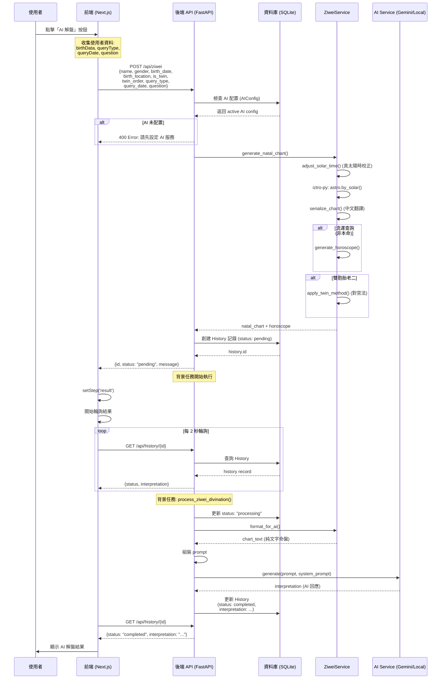

# 紫微斗數 AI 解盤流程文件

## 概述
本文件描述使用者按下「AI 解盤」按鈕後，從前端到後端再到 AI 服務的完整流程。

## 流程時序圖



## API 請求格式

### POST /api/ziwei

**Request Body:**
```json
{
  "birth_data_id": 1,           // 可選：已儲存的生辰八字 ID
  "name": "王小明",
  "gender": "male",             // "male" | "female"
  "birth_date": "1990-01-15T10:30:00.000Z",
  "birth_location": "台北市",
  "is_twin": false,
  "twin_order": null,           // "elder" | "younger" | null
  "query_type": "natal",        // "natal" | "yearly" | "monthly" | "daily"
  "query_date": null,           // 流運查詢時必填
  "question": "我的事業運勢如何？"
}
```

**Response:**
```json
{
  "id": 42,
  "status": "pending",
  "message": "占卜建立成功，AI 解讀中..."
}
```

## AI Prompt 格式

### System Prompt
來自 `backend/prompts/ziwei_system.md`，包含紫微斗數解盤專業知識。

### User Prompt
```text
【用戶問題】
我的事業運勢如何？

【命盤資料】
=== 基本資訊 ===
姓名: 王小明
性別: male
出生時間: 1990-01-15T10:30:00
出生地: 台北市

=== 本命命盤 ===
命宮: 未
身宮: 未
五行局: 水二局

=== 十二宮位 ===

【命宮】
  天干: 癸
  地支: 未
  主星: 天同, 巨門
  輔星: 陀羅

【兄弟宮】
  天干: 甲
  地支: 申
  主星: 天機
  輔星: 文昌, 文曲

... (其餘10宮)

=== 流運資訊 === (若有查詢流運)
查詢日期: 2025-01-14
查詢類型: yearly

【流年】
  天干: 乙
  地支: 巳
```

## 資料結構

### 命盤資料 (natal_chart)
```json
{
  "palaces": [
    {
      "index": 0,
      "name": "命",
      "heavenly_stem": "癸",
      "earthly_branch": "未",
      "major_stars": [
        {"name": "天同", "brightness": "旺", "mutagen": "忌"},
        {"name": "巨門", "brightness": "平", "mutagen": null}
      ],
      "minor_stars": [
        {"name": "陀羅", "brightness": null}
      ],
      "is_body_palace": true,
      "decadal": {"range": "2-11"},
      "ages": []
    }
    // ... 共12宮
  ],
  "earthly_branch_of_soul_palace": "未",
  "earthly_branch_of_body_palace": "未",
  "five_elements_class": "水二局",
  "birth_info": {
    "name": "王小明",
    "gender": "male",
    "original_time": "1990-01-15T10:30:00",
    "adjusted_time": "1990-01-15T10:25:00",
    "location": "台北市",
    "is_twin": false,
    "twin_order": null
  }
}
```

## 錯誤處理

| 狀態碼 | 錯誤 | 說明 |
|-------|------|------|
| 400 | 請先設定 AI 服務 | 使用者未在設定頁配置 AI |
| 400 | 流年/流月/流日需要提供查詢日期 | 非本命查詢但缺少 query_date |
| 500 | 占卜建立失敗：{error} | 後端處理錯誤 |

## 相關檔案

- **前端頁面**: [page.tsx](file:///Users/liewei/Documents/workspace/AI-Divination/frontend/src/app/ziwei/page.tsx)
- **後端 API**: [ziwei.py](file:///Users/liewei/Documents/workspace/AI-Divination/backend/app/api/ziwei.py)
- **紫微服務**: [ziwei.py](file:///Users/liewei/Documents/workspace/AI-Divination/backend/app/services/ziwei.py)
- **AI 服務**: [ai.py](file:///Users/liewei/Documents/workspace/AI-Divination/backend/app/services/ai.py)
- **System Prompt**: [ziwei_system.md](file:///Users/liewei/Documents/workspace/AI-Divination/backend/prompts/ziwei_system.md)
